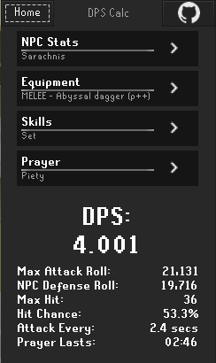
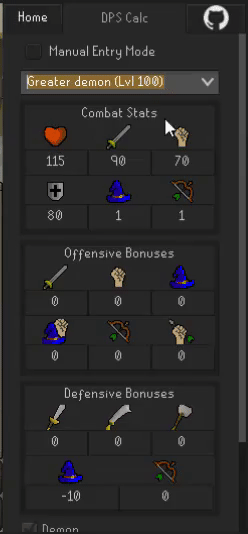
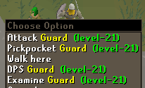
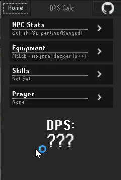
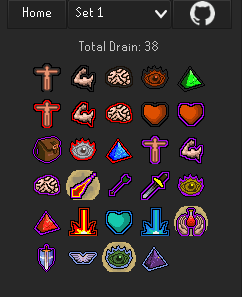

# Archived as of Feb. 1, 2025

As of writing, an upcoming RuneLite API change will break the plugin, and I have not had any interest in keeping it up to date for a while. If you care about this plugin and want to see it continued, join in on [this archival issue](#136).

# DPS Calculator

A side-panel plugin for RuneLite
that can display your current gear's
damage per second (DPS)
against NPC targets.

### Usage
From the home screen of the plugin,
you can navigate to each of the sub screens
by clicking on its appropriate header.
You can then navigate back to the main screen
by clicking on the "Home" button.

#### NPC Stats

NPC Stats can be filled in by 
selecting a preset through the dropdown,
entered manually by selecting "Manual Entry Mode",
or by using the right-click option on an NPC
(if enabled in the config).

#### Equipment

On the equipment selection screen,
your gear can be loaded in automatically
with the "Load From Client" button.
Alternatively, you can specify equipment manually
through the dropdown menus.

**Note: You must select an attack style
for this screen to be complete.**

#### Skills

In the skills screen,
you can once again load them automatically
using the "Load From Client" button.

In the Boosts section,
please enter any level boosts
(potions, dbaxe spec, etc).

#### Prayers

On the prayers screen,
you can select your offensive prayer,
which will affect your DPS,
and you can select any other prayers.
Note that the non-offensive prayers
will only be used to calculate 
how long your prayers will remain active.

