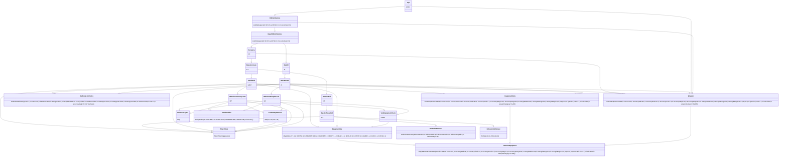

# Calculation took 27ms

```mermaid
classDiagram
Accuracy --|> BaseAccuracy
Accuracy --|> Weapon
AttackRoll --|> AttackStyle
AttackRoll --|> DefenderAttributes
AttackRoll --|> EffectiveAccuracyLevel
AttackRoll --|> EquipmentIds
AttackRoll --|> EquipmentStats
AttackRoll --|> Weapon
BaseAccuracy --|> AttackRoll
BaseAccuracy --|> DefenceRoll
BaseDefenceRoll --|> AttackStyle
BaseDefenceRoll --|> DefenderBonuses
BaseDefenceRoll --|> DefenderSkillsInput
BaseHitDistributions --|> Accuracy
BaseHitDistributions --|> MaxHit
BaseMaxHit --|> AttackStyle
BaseMaxHit --|> DefenderAttributes
BaseMaxHit --|> EffectiveStrengthLevel
BaseMaxHit --|> EquipmentIds
BaseMaxHit --|> EquipmentStats
BaseMaxHit --|> Weapon
CombatStyleBonus --|> AttackStyle
DefenceRoll --|> BaseDefenceRoll
Dpt --|> HitDistributions
Dpt --|> Weapon
EffectiveAccuracyLevel --|> AttackStyle
EffectiveAccuracyLevel --|> AttackerPrayers
EffectiveAccuracyLevel --|> AttackerSkills
EffectiveAccuracyLevel --|> CombatStyleBonus
EffectiveAccuracyLevel --|> VoidEquipmentCheck
EffectiveStrengthLevel --|> AttackStyle
EffectiveStrengthLevel --|> AttackerPrayers
EffectiveStrengthLevel --|> AttackerSkills
EffectiveStrengthLevel --|> CombatStyleBonus
EffectiveStrengthLevel --|> VoidEquipmentCheck
EquipmentIds --|> AttackerEquipment
EquipmentStats --|> AttackerEquipment
HitDistributions --|> BaseHitDistributions
HitDistributions --|> Weapon
MaxHit --|> BaseMaxHit
VoidEquipmentCheck --|> EquipmentIds
Weapon --|> AttackerEquipment
class Accuracy { 1.0 }
class AttackRoll { 12947 }
class AttackStyle { Slash (Slash/Aggressive) }
class AttackerEquipment { Map(WEAPON=ItemStats(itemId=13652,\n name=null,\n accuracyStab=41,\n accuracySlash=57,\n accuracyCrush=-4,\n accuracyMagic=0,\n accuracyRanged=0,\n strengthMelee=56,\n strengthRanged=0,\n strengthMagic=0,\n prayer=0,\n speed=4,\n slot=-1,\n is2h=false,\n weaponCategory=CLAW)) }
class AttackerPrayers { Set() }
class AttackerSkills { Skills(levels=(ATTACK=99,\n STRENGTH=99,\n RANGED=99,\n MAGIC=99),\n boosts=()) }
class BaseAccuracy { 1.0 }
class BaseDefenceRoll { 576 }
class BaseHitDistributions { List(Dist(expected=10.5,\n sumProb=1.0,\n outcomes=23)) }
class BaseMaxHit { 21 }
class CombatStyleBonus { GB(acc=+8,\nstr=+11) }
class DefenceRoll { 576 }
class DefenderAttributes { DefenderAttributes(npcId=-1,\n name=null,\n isDemon=false,\n isDragon=false,\n isKalphite=false,\n isLeafy=false,\n isUndead=false,\n isVampyre1=false,\n isVampyre2=false,\n isVampyre3=false,\n isGolem=false,\n size=1,\n accuracyMagic=0,\n inToa=false) }
class DefenderBonuses { DefensiveBonuses(defenseStab=0,\n defenseSlash=0,\n defenseCrush=0,\n defenseRanged=0,\n defenseMagic=0) }
class DefenderSkillsInput { Skills(levels=(),\n boosts=()) }
class Dpt { 2.625 }
class EffectiveAccuracyLevel { 107 }
class EffectiveStrengthLevel { 110 }
class EquipmentIds { Map(AMULET=-1,\n BOOTS=-1,\n WEAPON=13652,\n GLOVES=-1,\n BODY=-1,\n HEAD=-1,\n SHIELD=-1,\n CAPE=-1,\n AMMO=-1,\n LEGS=-1,\n RING=-1) }
class EquipmentStats { ItemStats(itemId=13652,\n name=null,\n accuracyStab=41,\n accuracySlash=57,\n accuracyCrush=-4,\n accuracyMagic=0,\n accuracyRanged=0,\n strengthMelee=56,\n strengthRanged=0,\n strengthMagic=0,\n prayer=0,\n speed=4,\n slot=-1,\n is2h=false,\n weaponCategory=CLAW) }
class HitDistributions { List(Dist(expected=10.5,\n sumProb=1.0,\n outcomes=23)) }
class MaxHit { 21 }
class VoidEquipmentCheck { NONE }
class Weapon { ItemStats(itemId=13652,\n name=null,\n accuracyStab=41,\n accuracySlash=57,\n accuracyCrush=-4,\n accuracyMagic=0,\n accuracyRanged=0,\n strengthMelee=56,\n strengthRanged=0,\n strengthMagic=0,\n prayer=0,\n speed=4,\n slot=-1,\n is2h=false,\n weaponCategory=CLAW) }
```